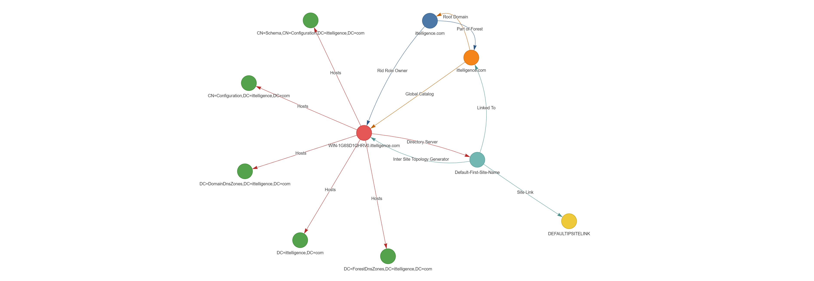

# ADTD (Active Directory Topology Diagrammer)

ADTD is a small Windows console app that queries your current Active Directory forest and exports the topology to a GraphML file (XML). The output can be visualised as an interactive graph (HTML) using the included Python helper script.



## What it exports

ADTD walks the forest using `System.DirectoryServices.ActiveDirectory` and emits a directed graph containing:

### Node types
- `:Forest`
- `:Site`
- `:SiteLink`
- `:Subnet`
- `:Server`
- `:Replication Connection`
- `:Partition`
- `:Domain`

### Edge labels
- `Linked To`
- `Site Link` (includes `Cost`)
- `Bridgehead Server`
- `Inter Site Topology Generator`
- `Directory Server`
- `Inbound Connection`
- `Outbound Connection`
- `Hosts`
- `Root Domain`
- `Part of Forest`
- `Domain Controller`
- `Infrastructure Role Owner`
- `Pdc Role Owner`
- `Rid Role Owner`
- `Naming Role Owner`
- `Schema Role Owner`
- `Global Catalog`

### Node and edge attributes
Each node and edge includes `<data key="...">...</data>` entries. At minimum, nodes include:
- `labels` (the node type, for example `:Site`)
- `Name` (display name)

Some edges also include extra data, for example `Cost` on `Site Link` edges.

Note: The exported GraphML is intentionally minimal and does not define `<key>` elements, it relies on consumers that can read arbitrary `<data key="...">` values.

## Requirements

### For the ADTD exporter (C#)
- Windows
- .NET Framework 4.8
- Network connectivity to a domain controller for the forest you want to query
- An account that can read AD topology (typical domain users can usually read most of this, hardened environments may require additional rights)

### For the visualiser (Python)
- Python 3.9+ recommended
- Packages:
  - `networkx`
  - `pyvis`

Install:
```bash
pip install networkx pyvis
